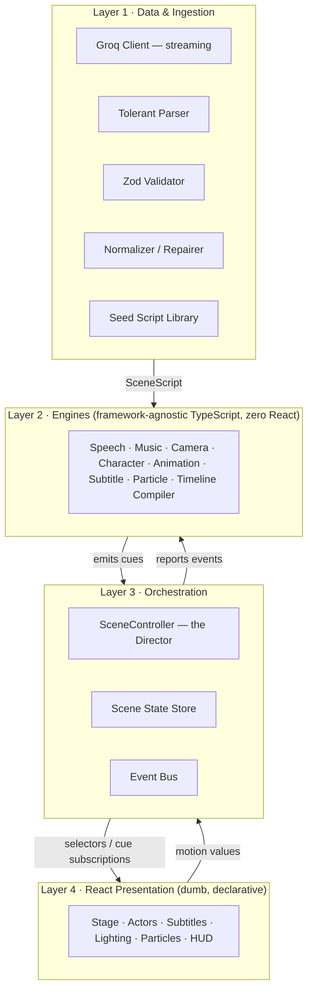
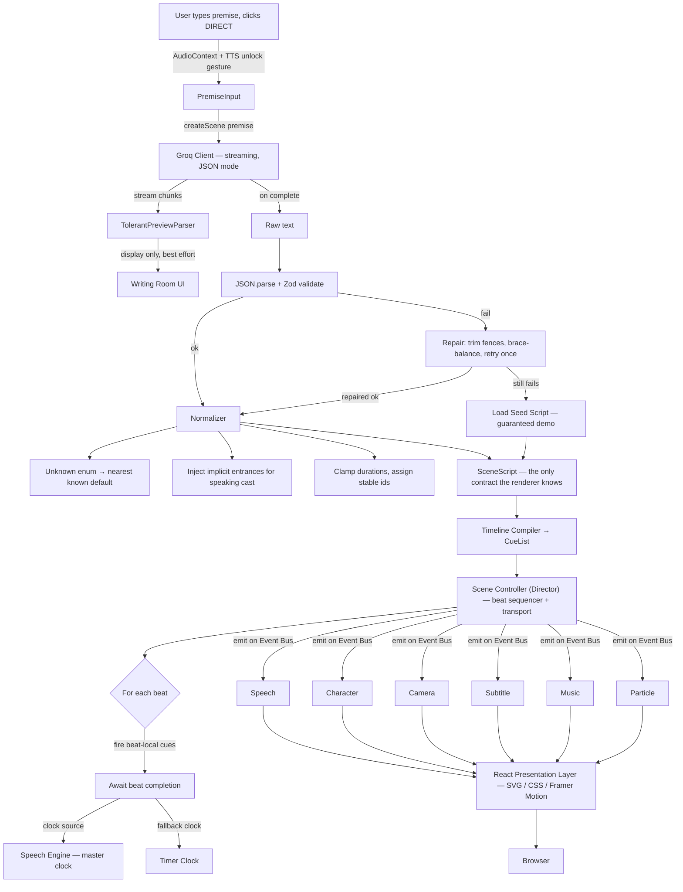
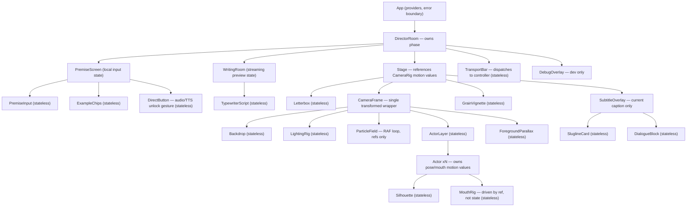

# Cold Open — Architecture

## 1. Overview

Cold Open is an AI-powered browser application that turns a single sentence into a live cinematic opening scene. A user types a premise; Groq generates structured scene data; a deterministic rendering engine performs it live in the browser — title card, slugline, character introductions, dialogue, ambient soundtrack, animated stage, silhouette actors, camera movement, lighting changes, and screenplay subtitles.

Cold Open is not an AI wrapper. It is an **event-driven rendering engine powered by AI**. Groq only generates structured scene data. The renderer never knows or cares where that data came from. Every subsystem is modular, replaceable, and independent.

## 2. High-Level Architecture

Four layers, one-directional dependency flow. Nothing in a lower layer imports from a higher one.



Layer 2 is the crown jewel. Engines are plain classes/factories with no React import, so they are unit-testable in Node in milliseconds and reusable in any host. React talks to them only through thin adapter hooks (`useCameraRig`, `useSpeech`).

### Two communication channels, deliberately separated

| Channel | Carries | Frequency | Why |
|---|---|---|---|
| **Event Bus** | Discrete cues: `dialogue:start`, `camera:move`, `light:change`, `beat:advance` | ~1–5 Hz | Decoupling. Any number of listeners, none aware of each other. |
| **Motion Values / refs** | Continuous values: camera transform, mouth openness, grain seed | 60 Hz | Never routed through the bus or React state. |

## 3. Data Flow



Note the back-edge: the Speech Engine both *consumes* cues and *emits* clock events the Controller depends on. That is the only feedback loop in the system, and it is intentional.

## 4. Core Systems

| System | Responsibility | Explicitly NOT responsible for |
|---|---|---|
| **Event Bus** | Typed pub/sub. `emit(event)`, `on(type, handler)`, `once`, `off`, wildcard tap for the debug overlay. | Ordering guarantees beyond synchronous FIFO; per-frame data; request/response. |
| **JSON Parser / Validator** | Extract JSON from model output (fence stripping, brace balancing), Zod-validate, coerce and default unknown enums, produce a `SceneScript` or a typed failure. | Prompting; retry policy; knowing about the renderer. |
| **Timeline Compiler** | Pure function `SceneScript → CueList`. Flattens beats, expands sugar (a dialogue line implicitly generates speech + subtitle + mouth + optional camera cues), sorts, freezes. | Time. It emits *anchors*, never wall-clock timestamps. |
| **Scene Controller (Director)** | The transport and sequencer. Advances beats, fires cues at their offsets, exposes `play/pause/skip/restart`, drives the phase machine, owns the clock-source strategy (speech vs. timer). | Rendering; audio; knowing what a cue *does*. |
| **Scene State Manager** | Single store of truth for durable state: phase, active `SceneScript`, cast roster + positions/poses, current caption, lighting preset, playback progress, user settings. | High-frequency transient values (camera matrix, mouth flap). |
| **Speech Engine** | Wraps `speechSynthesis`. Voice selection/casting (pitch + rate per character), utterance queue, sentence-splitting for long lines, `onboundary` → viseme/mouth events, `onend` → `beat:complete`. Detects unavailability and reports it so the Controller can switch clocks. | Subtitles. Animation. |
| **Dialogue Engine** | Turns a dialogue beat into an ordered plan: who speaks, parenthetical → gesture mapping, emphasis parsing, pacing/pauses between speakers. | Speaking (Speech). Displaying (Subtitle). |
| **Character Engine** | Owns the cast as data: registry, stage slot assignment (`farLeft…farRight`), facing, pose state machine (`idle → gesture → idle`), entrance/exit lifecycle. Resolves collisions when two characters are assigned the same slot. | Drawing pixels. |
| **Animation Engine** | The design-system layer for motion: named transition presets (`entrance.stride`, `gesture.point`, `exit.dissolve`), spring configs, easing curves, stagger helpers, and a `prefers-reduced-motion` degradation table. | Deciding *when* to animate. |
| **Camera Engine** | A virtual camera: `{ x, y, zoom, rotation, focusTarget }` as motion values, plus named moves (`pushIn`, `pullBack`, `panTo`, `dollyLeft`, `whipPan`, `craneUp`, `handheld`). Applies as one GPU-composited transform on a single wrapper node. | Layout. Never mutates child components. |
| **Subtitle Engine** | Screenplay-formatted caption presentation: character cue line, parenthetical, dialogue block, slugline cards. Word/char reveal timing synced to speech boundaries, with a duration-estimated fallback. Handles overflow and holds minimum legible dwell time. | Text content decisions. |
| **Music Engine** | Tone.js wrapper. Pure synthesis, zero sample files. Mood → arrangement (chord set, instrument voices, tempo, filter cutoff). Crossfades on mood change, ducks under dialogue, one-shot stingers on cue. Handles `AudioContext` unlock and suspend/resume on tab blur. | Timing the scene. It follows, never leads. |
| **Particle Engine** | Atmosphere: dust motes in the light shaft, rain, embers, smoke. Fixed-capacity pool, CSS/SVG transforms, driven by a single shared RAF loop. Auto-degrades count on low FPS. | Gameplay-grade physics. |
| **Scene Renderer** | The React tree that declaratively projects state onto SVG/CSS: backdrop layers, light shafts, actors, foreground parallax, letterbox, grain, vignette. | Any decision. It is a view function. |

## 5. Folder Structure

```
src/
├─ app/                    App shell, providers, routes, error boundary.
│                          Thin. Wiring only.
├─ features/
│  ├─ premise/             Input screen: textarea, example chips,
│  │                       "DIRECT" button, loading theatre.
│  ├─ stage/               The cinematic viewport and all its layers.
│  ├─ subtitles/           Screenplay caption overlay.
│  ├─ transport/           Play/restart/skip/mute HUD, progress bar.
│  └─ debug/               Dev-only: cue log, FPS, script inspector,
│                          seed-script picker. Tree-shaken in prod.
├─ engines/                Zero React imports. Pure TS. Unit-tested.
│  ├─ bus/                 Typed event bus + event type union.
│  ├─ controller/          SceneController, clock sources, phase machine.
│  ├─ timeline/            Compiler: SceneScript → CueList.
│  ├─ speech/              Speech engine + voice casting + capability probe.
│  ├─ music/               Tone.js graph, mood arrangements.
│  ├─ camera/              Camera rig + named moves.
│  ├─ character/           Cast registry, slots, pose machine.
│  ├─ dialogue/            Speaking plan: order, parenthetical→gesture map.
│  ├─ particles/           Pool + emitters.
│  └─ animation/           Motion presets, springs, reduced-motion map.
├─ ai/                     Groq client, streaming reader, tolerant preview
│                          parser, repair, retry policy. Swappable provider.
├─ schema/                 Zod schemas + inferred TS types + normalizer
│                          + defaults. THE contract. Imported by ai/ and
│                          engines/, owned by neither.
├─ store/                  Zustand store, sliced by domain, + selectors.
├─ scenes/                 Hand-authored seed SceneScripts (heist-library,
│                          noir-diner, sci-fi-airlock). Demo failsafe,
│                          fixture source, and design reference.
├─ design/                 Tokens: palette, lighting presets, silhouette
│                          geometry, type scale, timing constants.
├─ hooks/                  React↔engine adapters (useCue, useCameraRig…).
├─ lib/                    Generic utilities with no domain knowledge.
└─ types/                  Cross-cutting ambient types only.
```

**Rationale for the non-obvious choices:**

- **`engines/` separate from `features/`** is the whole reusability and testability story. If a file imports React, it does not belong in `engines/`.
- **`schema/` as a peer, not nested under `ai/`.** If the schema lives inside `ai/`, engineers start reaching into `ai/` from the renderer and the decoupling dies.
- **`scenes/` is a first-class source folder, not a fixture dump.** It is the demo insurance policy and lets the visual team work while the AI team works.
- **`design/`** exists so lighting presets and silhouette proportions are art-directed in one place, not scattered across components.
- **`features/` over `components/`** keeps co-located concerns together and keeps parallel work merge-conflict-free.

## 6. Component Hierarchy



**Ownership rules:**

1. `<DirectorRoom>` is the only phase-branching component.
2. `<Stage>` mounts the engines once (via `useSceneEngines`) and holds their handles in refs. Engines are never re-created on render. Camera `MotionValue`s are constructed and owned by the Camera Engine (not by `<Stage>`) since `MotionValue` has no React dependency; `<Stage>` only obtains a reference via a hook (resolves the ownership ambiguity found during the Milestone 0 design review).
3. `<Actor>` owns *transient* motion, the store owns *durable* position. Mouth flap and breathing never touch React state.
4. `<CameraFrame>` is a single transformed node. One `translate3d/scale` on a wrapper composites on the GPU; per-child transforms would not.
5. Subtitles re-render at most once per line, never per character — character reveal is CSS/`clip-path` or a motion value, not state.

## 7. JSON Schema Design

### Root — `SceneScript`

| Field | Type | Purpose |
|---|---|---|
| `version` | `"1.0"` | Migration safety. Validator rejects unknown majors. |
| `title` | string (≤40) | Movie title for the title card. |
| `genre` | enum: heist, noir, scifi, horror, romance, western, thriller, comedy, fantasy, drama | Drives visual + musical defaults. |
| `mood` | enum: tense, melancholy, playful, ominous, triumphant, mysterious, frantic, tender | Global affect. Music baseline. |
| `scene` | `SceneHeader` | Where and when. |
| `cast` | `Character[]` (1–3) | Speaking + silent presence. Cap at 3 for stage legibility. |
| `beats` | `Beat[]` (4–12) | The performance. Ordered. |
| `outro?` | `{ style: enum, text? }` | Cut-to-black / title-slam ending. |
| `meta?` | open record | Forward-compat sink. Renderer ignores it. |

### `SceneHeader`

`slugline` (string — "INT. GRAND LIBRARY – NIGHT") · `setting` (enum of ~12 backdrops: library, diner, alley, spaceship, forest, rooftop, warehouse, office, desert, apartment, subway, void) · `timeOfDay` (enum: dawn, day, dusk, night) · `weather?` (enum: clear, rain, fog, snow, storm) · `establishingText?`

### `Character`

`id` (slug, stable) · `name` · `archetype` (enum: leader, rookie, mastermind, guard, stranger, rival, mentor, ghost — drives silhouette build + default pose) · `build?` (enum: slight, average, heavy, tall) · `voice` (`{ register: low|mid|high, rate: slow|normal|fast, accentHint? }`) · `entrance` (`{ beat: number, from: enum offLeft|offRight|shadow|above|already-present, style: enum walk|stride|creep|burst|fade }`) · `exit?` (`{ beat, to, style }`) · `silhouetteAccent?` (enum: hat, coat, briefcase, cane, cape, none)

### `Beat` — discriminated union on `type`

Every beat shares: `id` · `type` · `holdMs?` (pause after) · `camera?` (`CameraDirection`) · `lighting?` (`LightingDirection`) · `music?` (`MusicDirection`) · `particles?` (`ParticleDirection`) · `movements?` (`Movement[]`).

That shared block is the key to expressiveness: any beat can carry any subsystem direction, so the AI composes cinema without a special beat type for each combination.

| `type` | Extra fields |
|---|---|
| `title` | `subtitle?` — title card slam |
| `slugline` | — renders the location card |
| `action` | `text` — screenplay action line, narrated or silent (`narrate: bool`) |
| `dialogue` | `characterId`, `line` (≤180 chars), `parenthetical?`, `delivery?` (enum: flat, urgent, whisper, shout, wry, trembling), `gesture?` (enum: point, shrug, step-forward, recoil, nod, reach, turn-away, none) |
| `beat` | silent dramatic pause — `durationMs` |
| `reveal` | `text?` — a stinger + hard lighting change; the "oh shit" moment |

### Direction sub-objects

- **`CameraDirection`** — `move` (enum: pushIn, pullBack, panLeft, panRight, whipPan, craneUp, dollyIn, handheld, static) · `target?` (characterId | center | wide) · `intensity?` (subtle|normal|dramatic) · `durationMs?`
- **`LightingDirection`** — `preset` (enum: warmInterior, coldMoonlight, singleSpot, silhouetteBacklight, neonWash, firelight, blackout, harshFluorescent) · `transition` (cut|fade|flicker) · `durationMs?`
- **`MusicDirection`** — `action` (start|swell|duck|stop|sting) · `mood?` · `intensity?` (0–1) · `stinger?` (enum: hit, riser, boom, chime, drone)
- **`ParticleDirection`** — `effect` (enum: dust, rain, embers, smoke, sparks, snow, none) · `density?` (0–1) · `action` (start|stop)
- **`Movement`** — `characterId` · `to` (slot enum: farLeft, left, center, right, farRight) · `style` (walk|rush|creep|drift) · `facing?` (left|right|front)

### Deliberate omissions and why

- **No absolute timestamps anywhere.** Timing is: beat order + `holdMs` + speech-derived duration. Absolute ms would guarantee desync.
- **No colors, no coordinates, no CSS.** The AI never touches presentation values. Enums only.
- **No nested beats.** Flat array; the compiler does the flattening work, not the model.
- **`version` + `meta`** are the only forward-compat mechanisms needed. Additive fields with defaults require no migration; a breaking change bumps the major and the normalizer maps old → new.

## 8. Event Flow

**Event taxonomy** (typed union, namespaced `domain:verb`):

`scene:*` — requested, generated, validated, failed, compiled, ready
`transport:*` — play, pause, restart, skip, complete
`beat:*` — enter, cues-fired, complete, exit
`speech:*` — start, boundary, end, error, unavailable
`camera:*` — move, shake, reset
`light:*` — change, flicker
`music:*` — start, mood, duck, unduck, sting, stop
`character:*` — enter, move, gesture, exit, mouth
`subtitle:*` — show, hide, slugline
`particle:*` — start, stop
`fx:*` — flash, cut-to-black, grain

### A dialogue beat, end to end

```mermaid
sequenceDiagram
    participant Controller as Scene Controller
    participant Camera as Camera Engine
    participant Lighting as Lighting
    participant Subtitle as Subtitle Engine
    participant Music as Music Engine
    participant Speech as Speech Engine
    participant Actor as Actor / Character

    Controller->>Controller: beat:enter { index: 3 }
    Controller->>Camera: camera:move { pushIn → char:vera } (offset 0ms)
    Controller->>Lighting: light:change { singleSpot, fade } (offset 0ms)
    Controller->>Subtitle: subtitle:show { "VERA", "(quietly)", ... } (offset 120ms)
    Controller->>Music: music:duck { to: 0.35 } (offset 120ms)
    Controller->>Speech: speech:request { char, line, voice } (offset 200ms)
    Speech->>Actor: speech:start → character:mouth{open}
    Speech->>Actor: character:gesture{point}
    Speech->>Subtitle: speech:boundary xN → reveal cursor
    Speech->>Actor: speech:boundary xN → mouth flap amplitude
    Speech->>Actor: speech:end → character:mouth{closed}
    Speech->>Music: speech:end → music:unduck
    Speech->>Controller: speech:end → beat:complete (CLOCK TICK)
    Controller->>Controller: honour holdMs, then beat:enter { index: 4 }
```

**Contracts the team must respect:**

1. The bus is fire-and-forget. No handler returns a value. The only "response" mechanism is emitting another event.
2. No engine subscribes to another engine's events for control — only the Controller closes loops. Engines may *observe* (Music listening for `speech:start` to duck is fine, because ducking is not control flow).
3. `beat:complete` has exactly one authoritative source per run: the active clock source. Speech Engine when TTS works, TimerClock otherwise. The Controller decides at `transport:play`, not per beat.
4. Idempotent handlers. A duplicate `light:change` must be harmless.
5. Every bus event is logged in dev to the debug overlay.

## 9. State Management

**Zustand, one store, sliced by domain, with `subscribeWithSelector`. Plus two escape hatches.**

Three tiers of state, each in the right place:

| Tier | Examples | Home | Why |
|---|---|---|---|
| **Durable app state** (low frequency, many readers) | phase, `SceneScript`, cast roster + slots, current caption, lighting preset, beat index, settings | Zustand | Selector subscriptions mean only affected components re-render. No provider tree, no boilerplate, readable outside React. |
| **Transient render state** (60 Hz) | camera transform, mouth openness, particle positions, grain seed | Framer `MotionValue` / refs | Zero React re-renders. |
| **Ephemeral local state** | textarea contents, hover, menu open | `useState` | Nobody else needs it. |

**Why Zustand over the alternatives:**

- **vs. Context + reducer** — Context re-renders every consumer on any change. With 60 Hz-adjacent updates and a deep tree, this is the wrong tool.
- **vs. Redux Toolkit** — More ceremony than the project needs.
- **vs. XState** — The theoretically correct model for the phase machine and beat sequencer, but the learning-curve tax makes it a poor trade here. Instead: a discriminated-union `phase` field in Zustand plus an explicit transition function that rejects illegal transitions. The migration path to XState stays open because the transition table already exists as data.
- **vs. putting playback state in the store at all** — Cues are events, not state. Storing "the current cue" in a store invites polling and ordering bugs. Events go on the bus; only their durable consequences land in the store.

**Slices:** `sceneSlice` (script, compiled cues, status) · `playbackSlice` (phase, beatIndex, isPlaying, clockSource) · `castSlice` (roster, slots, poses) · `presentationSlice` (caption, lighting preset, particle config) · `settingsSlice` (muted, captions on, reduced motion, voice enabled — persisted to localStorage).

**One hard rule:** engines write to the store through explicit action functions only. No engine ever calls `setState` with a raw object.

## 10. Engineering Risks

### Architecture

| Risk | Mitigation |
|---|---|
| Event-bus spaghetti — untraceable "who fired that?" | Strict `domain:verb` naming; one authoritative emitter per event type, documented in the event union; dev cue log showing emitter + payload. |
| Schema churn — a late field addition ripples through many files | Freeze the schema early. Additions must be optional with a default. The normalizer absorbs all drift so no engine has null checks. |
| The AI-wrapper trap — logic leaking into the Groq layer | Enforced by lint rule and by the fact that `scenes/` seed scripts must always play identically. If a seed script breaks, coupling has crept in. |

### Performance

| Risk | Mitigation |
|---|---|
| 60 Hz values in React state | MotionValues/refs for all continuous values. |
| Layout thrash from SVG filters (`feGaussianBlur`, `feTurbulence`) on animated nodes | Filters only on *static* layers. Animated elements use `transform` and `opacity` exclusively. Grain is a pre-baked, tiled data-URI PNG, not a live filter. |
| Particle count | Fixed pool (cap 60), shared RAF loop, auto-degrade on rolling FPS average below 50. |
| Camera transform on many nodes | One transform on one wrapper, `will-change: transform`, promoted to its own layer. |

### Browser Compatibility

| Risk | Mitigation |
|---|---|
| Web Speech absent or crippled | Capability probe at startup → timer clock. The product must be excellent with sound off. |
| iOS Safari — TTS needs a user gesture, queued utterances behave badly, audio often hardware-muted | Direct button as the unlock; utterances issued one at a time; mobile detection → simpler particle/filter path. |
| AudioContext autoplay policy | Never construct Tone.js before the Direct click. Explicit `Tone.start()` on that gesture, `resume()` on `visibilitychange`. |

### Speech API

| Limitation | Mitigation |
|---|---|
| No way to know utterance duration in advance | Never schedule against it. Beats complete on `onend`. Subtitle reveal uses `onboundary`, with a char-count-estimated fallback. |
| `getVoices()` returns empty on first call | Await `voiceschanged` with a 1.5s timeout, cache the roster, then cast characters. |
| Utterances garbage-collected mid-speech (Chromium bug) | Hold a hard reference to every live utterance until `onend`/`onerror`. |
| Long text silently truncates | Schema caps dialogue at 180 chars *and* the Speech Engine splits on sentence boundaries. |
| `onend` sometimes never fires | Watchdog timer at `estimatedDuration × 2`; on expiry force `beat:complete`. |
| `cancel()` leaves a dirty queue | Restart does `cancel()` → await a tick → clear internal queue → re-init. |

### Animation

| Risk | Mitigation |
|---|---|
| Framer Motion remount thrash when cast changes | Stable `character.id` keys; never index-keyed. |
| Overlapping animations on the same property fighting each other | Camera moves are queued through the Camera Engine, retargeting the same MotionValue rather than starting a second animation. |
| Motion sickness / accessibility | `prefers-reduced-motion` degradation table in `engines/animation/`. |

### Tone.js

| Risk | Mitigation |
|---|---|
| Bundle size | Import only needed modules; lazy-load the music engine after first paint. |
| Sample loading latency and failure | No samples. Synthesis only. |
| Voice count → audio dropouts | Hard polyphony cap; reuse a fixed set of synths across mood changes. |
| Clicks/pops on stop | Always ramp gain over ≥20ms. |
| Dispose leaks across restarts | Music engine is a singleton with explicit `reset()`. |

### Groq

| Risk | Mitigation |
|---|---|
| Invalid/partial JSON | JSON mode + tolerant extraction + Zod + normalizer + one repair retry + seed fallback. |
| Hallucinated enum values | Normalizer maps unknown → nearest known default and logs it. Never throws. |
| Latency spike or rate limit | The "writing room" typewriter makes latency feel intentional. Hard timeout → seed fallback. |
| API key exposure | Vercel serverless function proxy. The key is never in client code. |
| Service outage | Offline mode via seed scripts. |

### Scalability

The schema versioning field handles content evolution; the engine boundary means a WebGL renderer could replace the SVG one without touching anything else; the serverless proxy is the natural place for caching by premise hash and rate limiting; multi-scene "full short film" is just an array of `SceneScript`s fed to the same controller.
